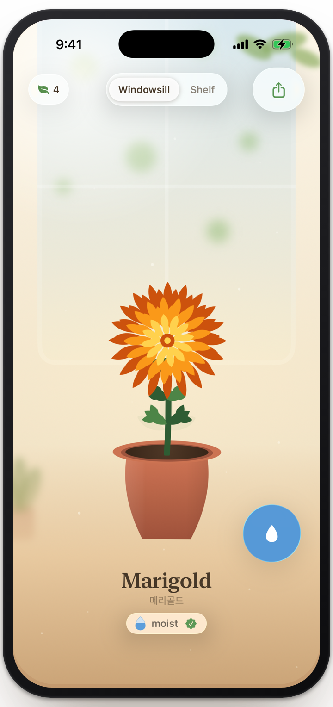
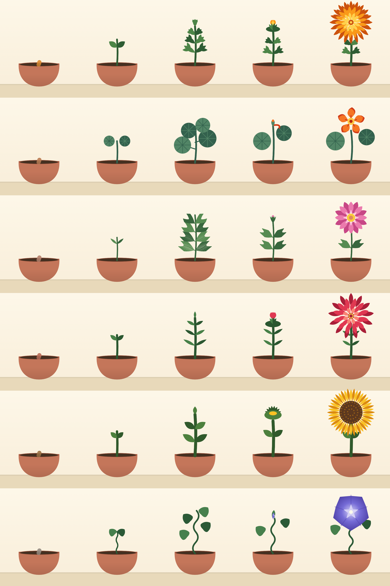

<div align="center">


# Ssak&nbsp;·&nbsp;싹

**Raise one flower from seed to bloom — on the real clock, tended gently, six to collect.**

<p>
  
  
  <a href="LICENSE"></a>
</p>



</div>

---

**Ssak** (싹, *"sprout"*) is a calm, quiet iOS game. You keep **one** plant on your
windowsill and raise it at the speed of a real plant — no timers to beat, nothing to
spend. Water a little, come back tomorrow, watch it grow.

### How it plays

- **On the real clock.** Your flower grows on its own compressed timeline — about a
  real day per plant-week — and only while it's healthy. Patience is the mechanic.
- **One at a time.** No sprawling garden to manage: one flower, your full attention,
  seed to bloom.
- **Forgiving by design.** Droop and gentle nudges, never punishment — no permadeath,
  and your shelf of past blooms is never lost.

### Collect six

<div align="center">

</div>

Marigold · Nasturtium · Cosmos · Zinnia · Sunflower · Morning&nbsp;glory — press each
bloom to your shelf.

### Run it

**You'll need** macOS with Xcode 26 and [XcodeGen](https://github.com/yonaskolb/XcodeGen) —
the UI adopts iOS 26 Liquid Glass, with graceful fallbacks back to iOS 16.

```sh
brew install xcodegen     # once
xcodegen generate         # from the repo root → Ssak.xcodeproj
open Ssak.xcodeproj        # pick a Simulator ▸ Run
```

`Ssak.xcodeproj` is generated from `project.yml` and isn't committed — re-run
`xcodegen generate` whenever the package set changes.

### Built with

100% Swift/SwiftUI · no backend · no third-party dependencies · hand-authored static
vector art. The game is three SwiftPM packages:

- **`SsakCore`** — pure, time-injected game logic (growth, moisture, streaks, persistence), fully unit-tested.
- **`SsakArt`** — every flower hand-drawn in SwiftUI `Path`s, authored through a headless render-to-PNG loop; no runtime art engine.
- **`SsakApp`** — the screens over a single `GardenModel` reducer.

No sound, no haptics — calm is the whole point ([ADR-0001](docs/adr/0001-no-sound-no-haptics.md)).

### Docs

- **Design spec** — [`docs/superpowers/specs/2026-07-19-ssak-design.md`](docs/superpowers/specs/2026-07-19-ssak-design.md)
- **UI redesign** — [round 1](docs/superpowers/specs/2026-07-20-ssak-redesign.md) · [round 2](docs/superpowers/plans/2026-07-22-ssak-redesign-round2.md)
- **Domain glossary** — [`CONTEXT.md`](CONTEXT.md)
- **Decision records** — [`docs/adr/`](docs/adr/)

### License

MIT © 2026 Michael Ju — see [LICENSE](LICENSE).
